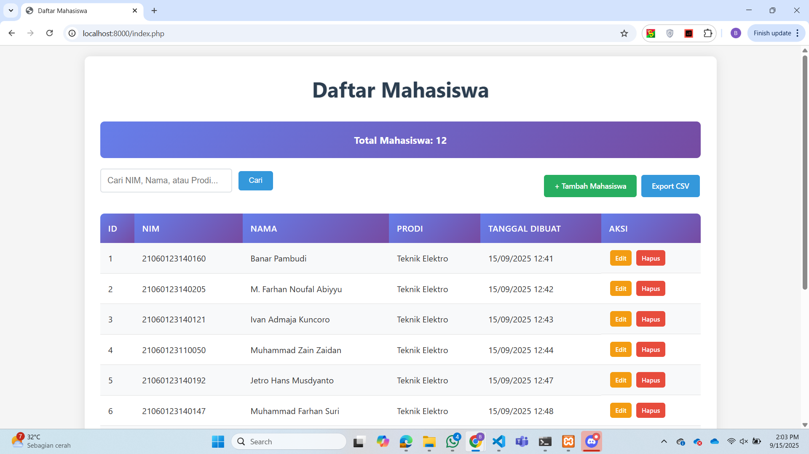
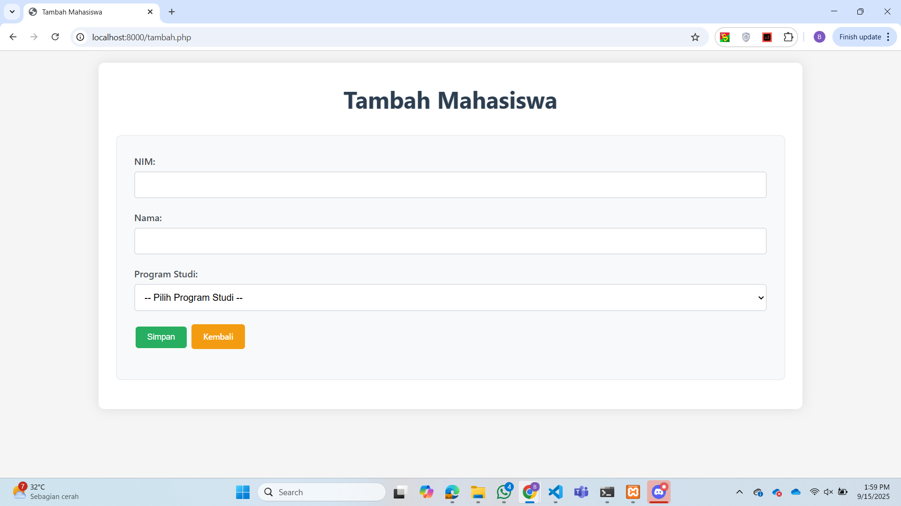
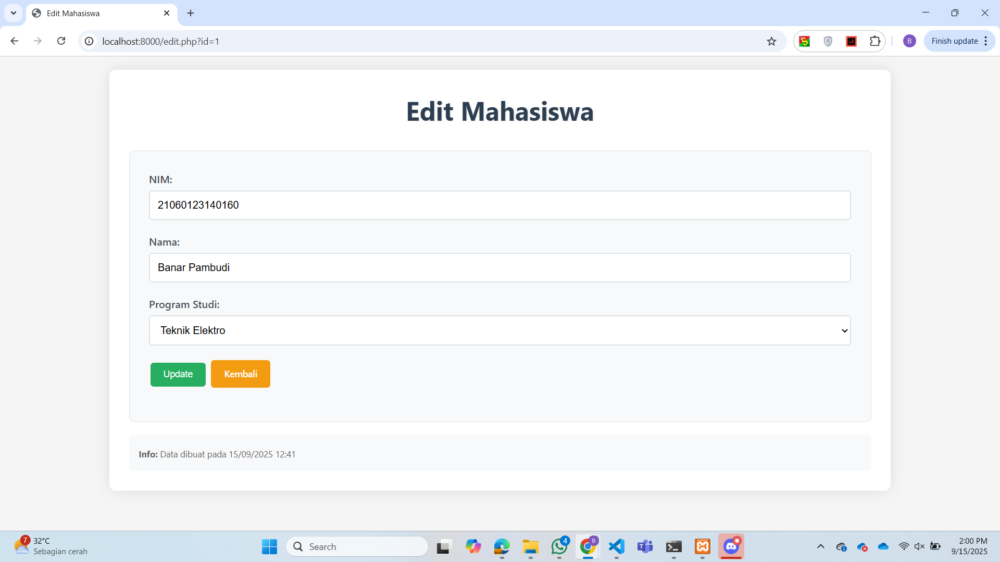
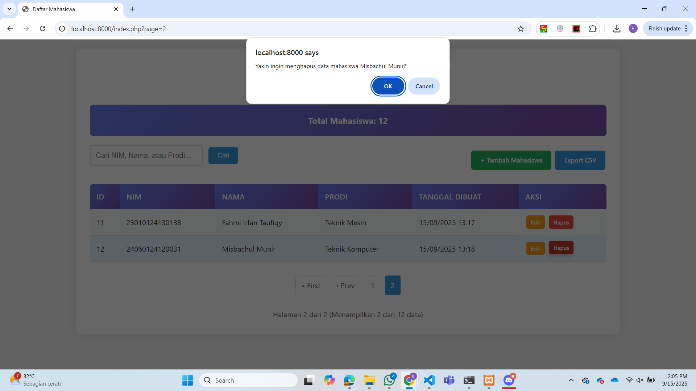
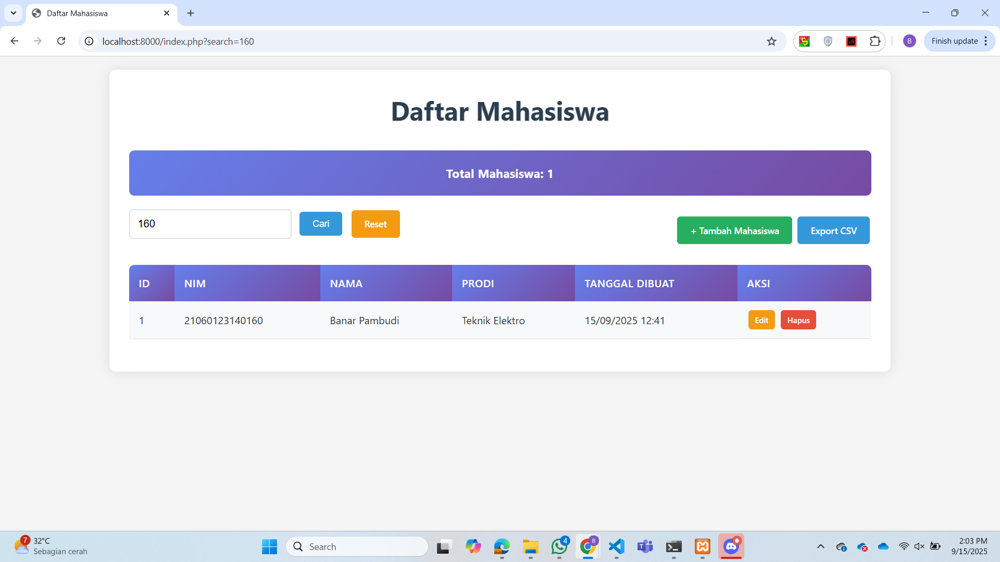
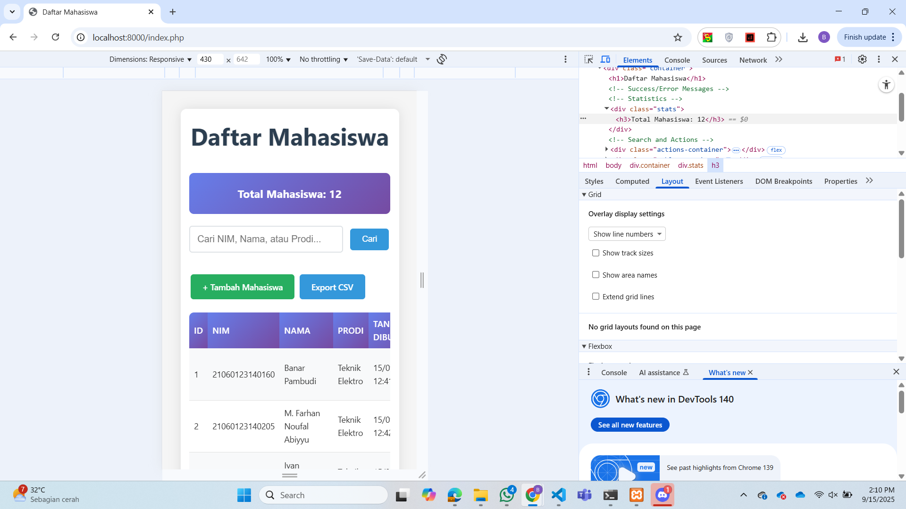

# CRUD Mahasiswa - Fitur yang Telah Diimplementasi

## Fitur Dasar
1. ✅ **Database & Tabel**
   - Database: `kampus`
   - Tabel: `mahasiswa` dengan kolom id, nim, nama, prodi, created_at, updated_at
   - Auto-create database dan tabel jika belum ada

2. ✅ **CRUD Operations**
   - CREATE: Tambah mahasiswa baru
   - READ: Tampilkan daftar mahasiswa
   - UPDATE: Edit data mahasiswa
   - DELETE: Hapus data mahasiswa

## Bonus Features

### 1. ✅ Validasi NIM Unik
- Pengecekan NIM duplikat saat tambah data
- Validasi NIM duplikat saat edit data (kecuali untuk data yang sama)
- Pesan error yang jelas jika NIM sudah terdaftar

### 2. ✅ Fitur Pencarian
- Pencarian berdasarkan NIM, Nama, atau Program Studi
- Real-time search dengan form yang responsif
- Opsi reset pencarian

### 3. ✅ Pagination
- Pagination otomatis jika data > 10 baris
- Navigasi halaman dengan First, Previous, Next, Last
- Informasi jumlah data dan halaman aktif
- Mempertahankan pencarian saat berpindah halaman

### 4. ✅ Export ke CSV
- Export semua data mahasiswa ke file CSV
- Mempertahankan hasil pencarian saat export
- Format CSV dengan header yang jelas
- Nama file: "daftar_mahasiswa.csv"

### 5. ✅ CSS Eksternal
- Desain modern dan responsif
- Styling untuk tabel, tombol, form, dan navigasi
- Gradient background untuk header tabel
- Hover effects dan animasi smooth
- Mobile-responsive design

## Fitur Tambahan

### Security & Validation
- ✅ Prepared statements untuk mencegah SQL injection
- ✅ Input sanitization dan validation
- ✅ XSS protection dengan htmlspecialchars()
- ✅ Validasi form client-side dan server-side

### User Experience
- ✅ Success/error message notifications
- ✅ Konfirmasi sebelum hapus data
- ✅ Form validation dengan JavaScript
- ✅ Auto-format input (NIM hanya angka, nama auto-capitalize)
- ✅ Dropdown untuk Program Studi
- ✅ Informasi timestamp created/updated

### Data Management
- ✅ Statistik total mahasiswa
- ✅ Auto-increment ID
- ✅ Timestamp untuk tracking data
- ✅ Soft error handling

## 🚀 Cara Install & Setup

### 1. Prerequisites
- XAMPP/WAMP/LAMP (PHP 7.4+ dan MySQL)
- Web browser modern
- Text editor (VS Code, Sublime, dll.)

### 2. Installation Steps
1. **Clone/Download project**
   ```bash
   git clone [repository-url]
   # atau download ZIP dan extract
   ```

2. **Setup database**
   - Jalankan XAMPP/WAMP
   - Buka `http://localhost/phpmyadmin`
   - Import file `kampus.sql` atau jalankan aplikasi (auto-create)

3. **Konfigurasi database** (jika diperlukan)
   - Edit file `db.php`
   - Sesuaikan username/password MySQL

4. **Jalankan aplikasi**
   - Akses `http://localhost/[folder-project]/index.php`

### 3. Upload ke GitHub
1. **Siapkan screenshots**
   - Ambil screenshot setiap halaman
   - Simpan di folder `screenshots/`
   - Format: PNG/JPG, max 1MB per file

2. **Push ke repository**
   ```bash
   git add .
   git commit -m "Add CRUD Mahasiswa application"
   git push origin main
   ```

## Database Schema
```sql
CREATE TABLE mahasiswa (
    id INT AUTO_INCREMENT PRIMARY KEY,
    nim VARCHAR(15) NOT NULL UNIQUE,
    nama VARCHAR(50) NOT NULL,
    prodi VARCHAR(50) NOT NULL,
    created_at TIMESTAMP DEFAULT CURRENT_TIMESTAMP,
    updated_at TIMESTAMP DEFAULT CURRENT_TIMESTAMP ON UPDATE CURRENT_TIMESTAMP
);
```

## Teknologi yang Digunakan
- PHP (mysqli)
- MySQL Database
- HTML5
- CSS3 (dengan Flexbox dan Grid)
- JavaScript (untuk validasi form)
- Responsive Web Design

## Cara Membuat SQL Dump

### 1. Melalui Command Prompt / PowerShell

Buka Command Prompt atau PowerShell sebagai Administrator, lalu jalankan perintah berikut:

```bash
# Dump database kampus dengan format yang mudah dibaca
mysqldump -u root -p --skip-extended-insert kampus > kampus.sql

# Dump dengan options tambahan untuk kompatibilitas
mysqldump -u root -p --skip-extended-insert --single-transaction --routines --triggers kampus > kampus_full.sql

# Dump hanya tabel mahasiswa
mysqldump -u root -p --skip-extended-insert kampus mahasiswa > mahasiswa.sql
```

**Penjelasan parameter:**
- `-u root`: Username MySQL (ganti sesuai username Anda)
- `-p`: Akan meminta password MySQL
- `--skip-extended-insert`: Format INSERT yang mudah dibaca (satu baris per record)
- `--single-transaction`: Konsistensi data untuk InnoDB
- `--routines`: Include stored procedures dan functions
- `--triggers`: Include triggers
- `kampus`: Nama database
- `> kampus.sql`: Output file

### 2. Melalui MySQL Command Line

Masuk ke MySQL prompt terlebih dahulu:

```bash
# Masuk ke MySQL
mysql -u root -p

# Dalam MySQL prompt, jalankan:
mysqldump -u root -p --skip-extended-insert kampus > kampus.sql
exit
```

Atau langsung dari MySQL prompt dengan perintah system:

```sql
-- Dalam MySQL prompt
SYSTEM mysqldump -u root -p --skip-extended-insert kampus > kampus.sql;
```

### 3. Melalui phpMyAdmin

1. **Buka phpMyAdmin** di browser (biasanya `http://localhost/phpmyadmin`)
2. **Login** dengan username dan password MySQL Anda
3. **Pilih database "kampus"** di panel kiri
4. **Klik tab "Export"** di bagian atas
5. **Pilih "Custom" export method** untuk options tambahan
6. **Konfigurasi export:**
   - Format: SQL
   - Tables: Pilih tabel yang ingin di-export (atau pilih semua)
   - Output: Save output to a file
   - Format-specific options:
     - ✅ Add DROP TABLE / VIEW / PROCEDURE / FUNCTION / EVENT / TRIGGER statement
     - ✅ Add CREATE PROCEDURE / FUNCTION / EVENT
     - ✅ Add IF NOT EXISTS (less efficient as indexes will be duplicated)
     - ✅ Include time stamp
7. **Klik "Go"** untuk download file SQL

### 4. Restore Database dari SQL Dump

Untuk merestore database dari file SQL dump:

```bash
# Melalui Command Prompt/PowerShell
mysql -u root -p kampus < kampus.sql

# Atau buat database baru terlebih dahulu
mysql -u root -p -e "CREATE DATABASE kampus_backup;"
mysql -u root -p kampus_backup < kampus.sql
```

Melalui MySQL prompt:
```sql
-- Buat database baru (opsional)
CREATE DATABASE kampus_backup;
USE kampus_backup;

-- Import file SQL
SOURCE C:/path/to/kampus.sql;
```

Melalui phpMyAdmin:
1. Pilih database tujuan
2. Klik tab "Import"
3. Choose file dan pilih file SQL dump
4. Klik "Go"

### Tips Backup Database

1. **Backup Rutin**: Lakukan backup secara berkala
2. **Verifikasi Backup**: Test restore di environment terpisah
3. **Kompres File**: Gunakan gzip untuk file backup yang besar
   ```bash
   mysqldump -u root -p --skip-extended-insert kampus | gzip > kampus.sql.gz
   ```
4. **Include Timestamp**: Tambahkan tanggal di nama file
   ```bash
   mysqldump -u root -p --skip-extended-insert kampus > kampus_$(date +%Y%m%d_%H%M%S).sql
   ```

## 🏆 Demo & Live Preview

### Quick Demo
1. **Dashboard**: Lihat daftar mahasiswa dengan pagination
2. **Tambah Data**: Form dengan validasi NIM unik
3. **Edit Data**: Update informasi mahasiswa
4. **Hapus Data**: Hapus data mahasiswa
5. **Pencarian**: Cari berdasarkan NIM/nama/prodi
6. **Export**: Download data dalam format CSV
7. **Mobile**: Responsive design untuk semua device

### Features Highlight
- 🔒 **Security**: Prepared statements, XSS protection
- 🎨 **UI/UX**: Modern design, smooth animations
- 📱 **Responsive**: Mobile-friendly interface
- ⚡ **Performance**: Efficient pagination & search
- 📊 **Export**: CSV download functionality

## 📄 License

This project is created for educational purposes as part of Web Programming coursework.

## 📸 Screenshots Aplikasi

### Halaman Utama (Dashboard)

*Halaman utama dengan daftar mahasiswa, fitur pencarian, dan pagination*

### Form Tambah Mahasiswa

*Form untuk menambah data mahasiswa baru dengan validasi*

### Form Edit Mahasiswa

*Form untuk mengedit data mahasiswa yang sudah ada*

### Fitur Hapus Data

*Fitur untuk menghapus data mahasiswa yang sudah ada*

### Fitur Pencarian

*Fitur pencarian berdasarkan NIM, nama, atau program studi*

### Mobile Responsive

*Tampilan responsif untuk perangkat mobile*

---

### 📧 Contact
- **Developer**: Banar Pambudi
- **Email**: banarpambudi094@gmail.com
- **LinkedIn**: linkedin.com/in/banarpambudi
- **Course**: Pemrograman Web - Semester 5
